# Calendulum


> Derived from _Calendula_, the marigold flower named after the Roman _calendae_ — it blooms every month, like the calendars you build.

A reusable, customizable calendar suite for modern Angular (17+). Standalone components, signals, SCSS theming, zero external runtime dependencies.

**Status:** early development — the first slice (`CalendulumMonth`) is working; the full suite (week/month/day views, date/range pickers, agenda, drag & drop, i18n) is on the roadmap.

- [Install](#install)
- [Usage](#usage)
- [API](#api)
- [Theming](#theming)
- [Custom templates](#custom-templates)
- [Per-day styling (`dayStyle`)](#per-day-styling-daystyle)
- [Day clicks (`dayClick`)](#day-clicks-dayclick)
- [Disabled days (`isDayDisabled`)](#disabled-days-isdaydisabled)
- [Visible days (`visibleDays`)](#visible-days-visibledays)
- [Day cell slots](#day-cell-slots)
- [Visual theming](#visual-theming)
- [Extended navigation](#extended-navigation)
- [Selection modes](#selection-modes)
- [Week numbers](#week-numbers)
- [Development](#development)
- [Roadmap](#roadmap)
- [License](#license)

## Install

Not yet published to npm — use the source workspace while it matures.

## Usage

```ts
import { Component, signal } from '@angular/core';
import { CalendulumMonth } from 'calendulum';

@Component({
  selector: 'app-root',
  imports: [CalendulumMonth],
  template: `
    <calendulum-month [(value)]="selected" />
    <p>Selected: {{ selected() }}</p>
  `,
})
export class App {
  readonly selected = signal<Date | null>(null);
}
```

## API

### `CalendulumMonth`

| Input             | Type                                                                    | Default       | Description                                                                                |
| ----------------- | ----------------------------------------------------------------------- | ------------- | ------------------------------------------------------------------------------------------ |
| `value` (model)   | `Date \| null \| Date[] \| { start: Date \| null; end: Date \| null }`  | `null`        | Selected day(s). Two-way bindable with `[(value)]`. Type depends on `selectionMode`.       |
| `firstDayOfWeek`  | `0 \| 1`                                                                | `1`           | `1` = Monday-first, `0` = Sunday-first.                                                    |
| `locale`          | `string`                                                                | `LOCALE_ID`   | Locale used for titles and weekday labels.                                                 |
| `showOutsideDays` | `boolean`                                                               | `true`        | Render the 42-cell grid with neighbor-month days.                                          |
| `dayCell`         | `TemplateRef<{ $implicit: CalendulumDayCellContext }>`                  | —             | Replaces the default day button.                                                           |
| `dayCellTop`      | `TemplateRef<{ $implicit: CalendulumDayCellContext }>`                  | —             | Overlay template above the day number (default button only).                               |
| `dayCellBottom`   | `TemplateRef<{ $implicit: CalendulumDayCellContext }>`                  | —             | Overlay template below the day number (default button only).                               |
| `dayStyle`        | `Record<string, DayStyle>`                                              | `{}`          | Per-day styles keyed by local ISO date — see [`dayStyle`](#per-day-styling-daystyle).      |
| `isDayDisabled`   | `(date: Date) => boolean`                                               | `() => false` | Marks dates that refuse UI activation — see [disabled days](#disabled-days-isdaydisabled). |
| `visibleDays`     | `'all' \| 'mondayToFriday' \| 'mondayToSaturday' \| readonly Weekday[]` | `'all'`       | Projects whole weekday columns — see [visible days](#visible-days-visibledays).            |
| `fontSize`        | `'sm' \| 'md' \| 'lg'`                                                  | `'md'`        | Text size scale — see [visual theming](#visual-theming).                                   |
| `density`         | `'compact' \| 'cozy' \| 'spacious'`                                     | `'cozy'`      | Spacing scale (padding, gaps, header height) — see [visual theming](#visual-theming).      |
| `cornerRadius`    | `'sm' \| 'md' \| 'lg' \| 'full'`                                        | `'md'`        | Border radius scale — see [visual theming](#visual-theming).                               |
| `minDate`         | `Date \| null`                                                          | `null`        | Minimum selectable date (inclusive) — see [extended navigation](#extended-navigation).     |
| `maxDate`         | `Date \| null`                                                          | `null`        | Maximum selectable date (inclusive) — see [extended navigation](#extended-navigation).     |
| `monthSelector`   | `'dropdown' \| 'arrows' \| 'none'`                                      | `'arrows'`    | Month navigation mode — see [extended navigation](#extended-navigation).                   |
| `selectionMode`   | `'single' \| 'multiple' \| 'range'`                                     | `'single'`    | Selection behavior — see [selection modes](#selection-modes).                              |
| `weekNumbers`     | `boolean`                                                               | `false`       | Show ISO week number column — see [week numbers](#week-numbers).                           |

| Output        | Type                      | Description                                                                        |
| ------------- | ------------------------- | ---------------------------------------------------------------------------------- |
| `monthChange` | `Date`                    | Emits the first day of the visible month on navigation.                            |
| `dayClick`    | `CalendulumDayClickEvent` | Emits `{ date, x, y }` on day activation — see [day clicks](#day-clicks-dayclick). |
| `valueChange` | varies by mode            | Emits the updated selection model — see [selection modes](#selection-modes).       |

`CalendulumDayCellContext` is the implicit template context (bound via `let-day`) and exposes
`{ date: Date, inMonth: boolean, isToday: boolean, isSelected: boolean, isDisabled: boolean, weekNumber: number \| null, isInRange: boolean, isRangeStart: boolean, isRangeEnd: boolean }`
— the flags reflect the current `value`, today, the `isDayDisabled` predicate, bounds, and the
`selectionMode` at render time. The type and this documentation always match field-for-field.

## Theming

The component is styled with CSS custom properties scoped through `:host`:

```
--cld-accent, --cld-accent-contrast, --cld-accent-soft,
--cld-bg, --cld-border, --cld-text, --cld-text-muted,
--cld-radius
```

Override them on the component selector or a parent:

```css
calendulum-month {
  --cld-accent: oklch(68% 0.17 65);
  --cld-bg: oklch(99% 0.01 75);
}
```

## Custom templates

Pass any template as `dayCell` — it receives the day context via `let-day` and replaces the
default interaction cell:

```html
<calendulum-month [dayCell]="dayCell" />
<ng-template #dayCell let-day>
  <span [class.today]="day.isToday">{{ day.date.getDate() }}</span>
</ng-template>
```

The custom cell wrapper is interactive with button semantics: it has `role="button"` and
`tabindex="0"`, and activation (click, Enter, Space) emits `dayClick` and selects the day —
the same behavior as the default button.

## Per-day styling (`dayStyle`)

Style individual days with a record keyed by local ISO date strings (`YYYY-MM-DD`). Keys are
produced with the exported `dateKey()` helper, which uses local calendar getters (never
`toISOString`, so keys never shift across timezones):

```ts
import { dateKey, DayStyle } from 'calendulum';

const styles: Record<string, DayStyle> = {
  [dateKey(today)]: { border: '2px solid tomato' }, // border only
  [dateKey(holiday)]: { background: 'pink', color: '#7a1f1f' }, // fill + text
  [dateKey(special)]: { class: ['hl', 'spin'] }, // extra classes
};
```

```html
<calendulum-month [dayStyle]="styles" />
```

<!-- Screenshots: place in docs/screenshots/ -->
<!--  -->
<!--  -->
<!--  -->

Each entry may set `border`, `color`, `background` (raw CSS strings) and `class` (string or
string array). They are applied through the per-cell custom properties `--cld-day-border`,
`--cld-day-color`, and `--cld-day-bg`, consumed by the base cell rule — so **state classes
win over `dayStyle`**:

- Today and selected cells keep their state background/text color even when the entry sets
  `background` or `color`.
- A `dayStyle` `border` **always applies** — the state rules do not set a border (the one
  documented exception).
- Consumer `class` entries are merged with (never replace) the state classes.
- Outside (neighbor-month) cells: the `--outside` state class overrides the cell text color,
  so a `color` entry has no visible effect on them (backgrounds and borders still apply).

The full visual precedence ladder, highest first: selected background/text > today/disabled
state styles > hover > `dayStyle` background/color — with `dayStyle` border as the exception
that always applies.

## Day clicks (`dayClick`)

Activating a day (click on the default button or a custom `dayCell` wrapper) emits
`dayClick` with `{ date, x, y }`, where `x`/`y` are the event's viewport coordinates
(`clientX`/`clientY`), and then selects the day through the `value` model — `dayClick` is
additive to selection.

Clicking an outside day emits and selects without navigating: the view month is unchanged and
`monthChange` does not fire. Hidden decorative cells (with `showOutsideDays` off) never emit.

Keyboard activation (custom `dayCell` only — Enter and Space) also emits `dayClick`; a
`KeyboardEvent` carries no coordinates, so the payload uses the documented convention
`{ date, x: 0, y: 0 }`.

<!-- Screenshots: place in docs/screenshots/ -->
<!-- 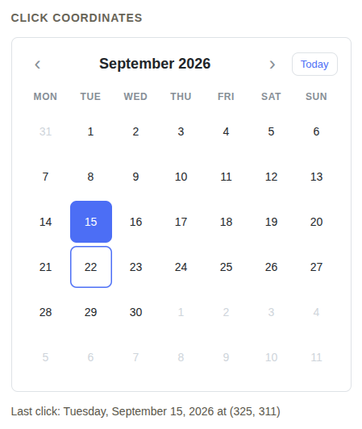 -->

To anchor a popover or tooltip to the clicked day, translate the viewport point into the
calendar's coordinate space:

```ts
onDayClick({ date, x, y }: CalendulumDayClickEvent) {
  const host = this.calendarRef.nativeElement.getBoundingClientRect();
  popover.show(date, { left: x - host.left, top: y - host.top });
}
```

## Disabled days (`isDayDisabled`)

Mark dates that must not be activatable (booked, holidays, past) with a predicate:

```ts
import { dateKey } from 'calendulum';

const holidayKeys = new Set([dateKey(new Date(2026, 11, 25))]);
const isDayDisabled = (d: Date) => holidayKeys.has(dateKey(d));
```

```html
<calendulum-month [isDayDisabled]="isDayDisabled" />
```

<!-- Screenshots: place in docs/screenshots/ -->
<!-- 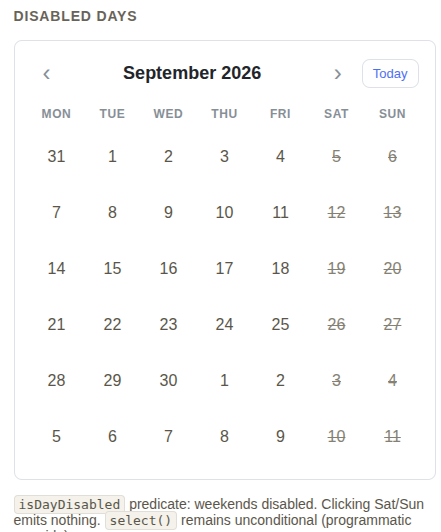 -->

Pass a **stable function reference** — inline arrows (`[isDayDisabled]="(d) => ..."`) create a
new function every change detection and re-fire the predicate for every cell. The key-set recipe
above (`Set` of `dateKey()` strings + a stable closure) is the recommended pattern for a fixed
set of dates; ranges and recurring rules are one-liners in the same shape.

Disabled state is **UI-only**:

- Disabled dates emit no `dayClick` and never set `value` — from the default button, the custom
  `dayCell` wrapper, and outside-month cells alike (Enter/Space included).
- Programmatic `select(date)` and `goToToday()` stay unconditional: a disabled date can still
  hold the `value` model, and today can be disabled without breaking "Today".
- Disabled cells stay **focusable** — `aria-disabled="true"` with no native `disabled`
  attribute, on both branches, so screen-reader users still reach and hear the date.
- Cells resolve the `cld-month__day--disabled` state class (appended by `resolveCellClasses`).
  The stylesheet suppresses the hover background and the pointer cursor, while today/selected
  visuals still apply (a disabled today keeps its ring; a disabled selected day keeps its
  accent). The disabled hover neutralizer yields to the selected hover background.
- Templates receive `isDisabled` in the context, so custom `dayCell` content can render its own
  disabled affordance:

```html
<calendulum-month [dayCell]="dayCell" [isDayDisabled]="isDayDisabled" />
<ng-template #dayCell let-day>
  <span [class.struck]="day.isDisabled">{{ day.date.getDate() }}</span>
</ng-template>
```

## Visible days (`visibleDays`)

Restrict the calendar to a working-week view by projecting away whole weekday columns — never
individual dates, so every row stays complete and the grid always renders **6 rows**:

- `'all'` (default) — 7 columns, 42 cells.
- `'mondayToFriday'` — {1,2,3,4,5}, 5 columns, 30 cells.
- `'mondayToSaturday'` — {1,2,3,4,5,6}, 6 columns, 36 cells.
- `readonly Weekday[]` — any weekday list (`0` = Sunday … `6` = Saturday); values are deduped
  and sorted, out-of-range numbers are dropped, and an empty resolved set falls back to
  `'all'` — the grid never renders zero columns. Any other value also normalizes to `'all'`.

```html
<calendulum-month [visibleDays]="'mondayToFriday'" />
```

<!-- Screenshots: place in docs/screenshots/ -->
<!-- 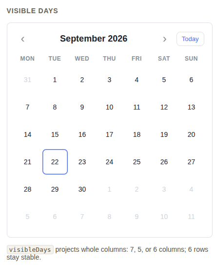 -->
<!-- 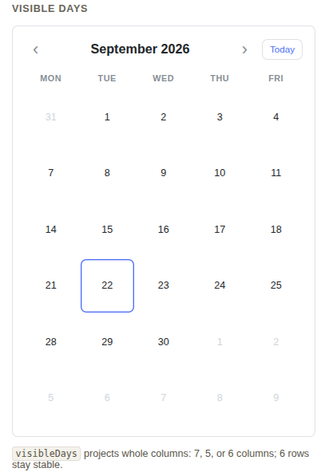 -->
<!-- 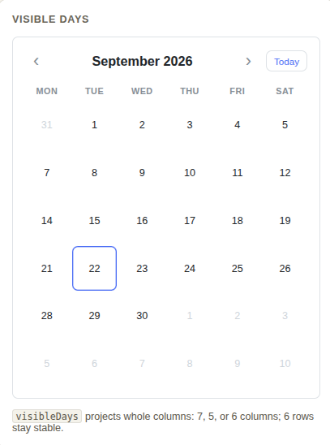 -->

Column count is derived from the resolved set and bound as `--cld-week-columns` on the section;
both the header track and the grid consume it (`repeat(var(--cld-week-columns), 1fr)`), so
labels always align with their columns. It is safe to combine with `dayStyle`, `dayCell`, the
slots, and `isDayDisabled` — the predicate is only consulted for cells that exist.

Behavioral notes:

- **Hidden weekday `value`**: the model is authoritative, the view is a projection. A `value`
  landing on a hidden weekday stays set with no selected cell rendered.
- **`firstDayOfWeek=0` + `mondayToSaturday`**: the Sunday column simply does not exist — the
  first column is Monday (label order still follows `firstDayOfWeek`).
- **Navigation is unchanged** by `visibleDays`: months move and `monthChange` fires the same,
  with the same filter applied to the new month.

## Day cell slots

`dayCellTop` and `dayCellBottom` render consumer content above/below the day number without
disturbing its centered position (absolute overlays, `pointer-events: none`). They receive the
same context as `dayCell`:

```html
<calendulum-month [dayCellTop]="top" [dayCellBottom]="bottom" />
<ng-template #top let-day>
  <span class="badge" [class.hot]="day.isToday">★</span>
</ng-template>
<ng-template #bottom let-day> @if (day.isSelected) { <span class="dot">●</span> } </ng-template>
```

<!-- Screenshots: place in docs/screenshots/ -->
<!--  -->
<!--  -->

Slot content never intercepts pointer events — clicks landing on it still activate the day.
When `dayCell` is provided, it fully replaces the cell and slots do not render.

## Visual theming

Three discrete inputs let you scale the entire component without custom CSS:

<!-- Screenshots: place in docs/screenshots/ -->
<!-- 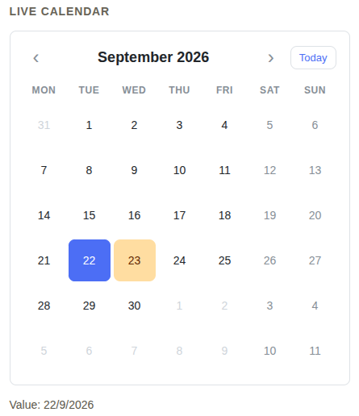 -->
<!-- 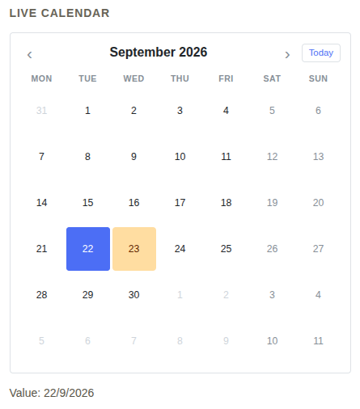 -->
<!-- 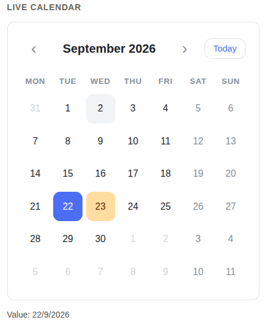 -->

| Input          | Type                                | Default  | Effect                                                                                                   |
| -------------- | ----------------------------------- | -------- | -------------------------------------------------------------------------------------------------------- |
| `fontSize`     | `'sm' \| 'md' \| 'lg'`              | `'md'`   | Scales all text via `--cld-font-size-multiplier` (0.875 / 1 / 1.125).                                    |
| `density`      | `'compact' \| 'cozy' \| 'spacious'` | `'cozy'` | Scales spacing (cell padding, grid gap, header height) via `--cld-density-multiplier` (0.75 / 1 / 1.25). |
| `cornerRadius` | `'sm' \| 'md' \| 'lg' \| 'full'`    | `'md'`   | Overrides `--cld-radius` via `--cld-radius-override` (0.25rem / 0.5rem / 0.75rem / 9999px).              |

All three write their own CSS custom property multiplier (`--cld-font-size-multiplier`,
`--cld-density-multiplier`, `--cld-radius-override`) which the base stylesheet consumes via
`calc()`. You can still override the base properties directly (`--cld-radius`, etc.) and the
inputs will still work as presets.

```html
<calendulum-month fontSize="lg" density="spacious" cornerRadius="lg" />
```

The inputs accept only their discrete tiers; invalid values fall back to the default.

## Extended navigation

Two bounds inputs clamp the calendar to an absolute date range, and a month selector
gives users a faster way to jump months.

<!-- Screenshots: place in docs/screenshots/ -->
<!-- 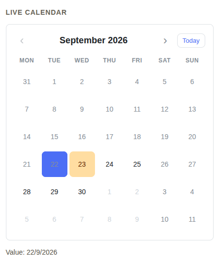 -->
<!-- 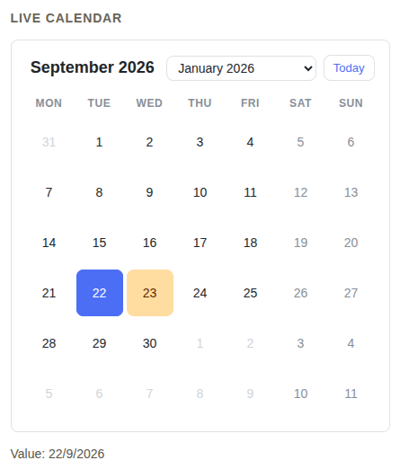 -->

### Bounds (`minDate`, `maxDate`)

```ts
import { Component, signal } from '@angular/core';
import { CalendulumMonth } from 'calendulum';

@Component({
  selector: 'app-booking',
  imports: [CalendulumMonth],
  template: ` <calendulum-month [minDate]="today()" [maxDate]="maxDate()" [(value)]="checkIn" /> `,
})
export class Booking {
  protected readonly today = signal(new Date());
  protected readonly maxDate = signal(new Date(2026, 11, 31));
  protected readonly checkIn = signal<Date | null>(null);
}
```

Behavior:

- `minDate` / `maxDate` are **inclusive** calendar bounds (day granularity).
- On `value` set, the model is clamped to the bounds (out-of-range dates snap to the nearest
  bound).
- Navigation buttons (`‹` / `›`) disable when the view month would step past a bound.
- Cells outside the bounds render as **disabled** (merged with `isDayDisabled` via OR logic).
- Programmatic `select(date)` and `goToToday()` bypass bounds — they remain unconditional.

### Month selector (`monthSelector`)

```html
<calendulum-month monthSelector="dropdown" />
```

Three modes:

| Mode         | Behavior                                                                     |
| ------------ | ---------------------------------------------------------------------------- |
| `'arrows'`   | Previous/next buttons (default).                                             |
| `'dropdown'` | Native `<select>` with month options filtered by `minDate`/`maxDate` bounds. |
| `'none'`     | Only the month title — no navigation controls.                               |

The dropdown uses a native `<select>` for full accessibility; options are filtered to the
`minDate`/`maxDate` range. It is styled via the existing CSS custom properties (`--cld-font`,
`--cld-radius`, `--cld-bg`, etc.) so it inherits your theme automatically.

## Selection modes

The `selectionMode` input controls how `value` behaves and how users select dates.

<!-- Screenshots: place in docs/screenshots/ -->
<!-- 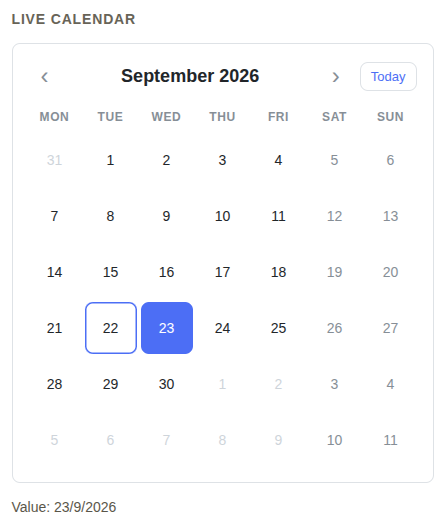 -->
<!-- 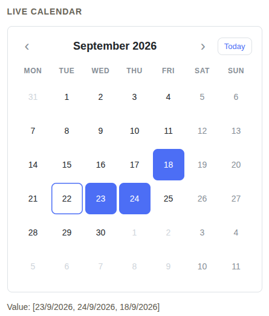 -->
<!-- 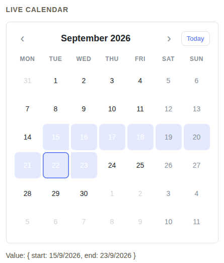 -->

```html
<calendulum-month selectionMode="range" [(value)]="range" />
```

| Mode         | `value` type                                 | Behavior                                                                                |
| ------------ | -------------------------------------------- | --------------------------------------------------------------------------------------- |
| `'single'`   | `Date \| null`                               | Click selects one day; clicking the same day clears. **Default — backward compatible.** |
| `'multiple'` | `Date[]`                                     | Click toggles days in/out of the array.                                                 |
| `'range'`    | `{ start: Date \| null; end: Date \| null }` | First click sets start, second sets end (auto-reorders if end < start).                 |

The `value` model is a simple union: `Date \| null` (single), `Date[]` (multiple),
`{ start: Date \| null; end: Date \| null }` (range). The `selectionMode` input is the
external discriminant — it determines which branch is active and which operations are
allowed. Default `'single'` accepts `Date \| null` so existing consumers need no migration.

**Range auto-reorder**: if the second click sets an end date before the start, the range
auto-reorders (start/end swap). Programmatic `select()` and `goToToday()` work in all
modes (they bypass disabled/bounds guards).

```ts
// single (default)
const single = signal<Date | null>(null);

// multiple
const multiple = signal<Date[]>([]);

// range
const range = signal<{ start: Date | null; end: Date | null }>({ start: null, end: null });
```

The `valueChange` output fires with the updated model in the same union shape.

## Week numbers

```html
<calendulum-month weekNumbers />
```

When `weekNumbers=true`, an ISO week number column (1–53) is prepended as the first column.
The grid becomes 8 columns (7 days + week), `--cld-week-columns` adjusts automatically,
and the header shows a "Wk" label. The week column cells expose `weekNumber` in the
template context so custom `dayCell`/`dayCellTop`/`dayCellBottom` templates can read it.

```html
<calendulum-month weekNumbers [dayCellBottom]="weekBottom" />
<ng-template #weekBottom let-day>
  @if (day.weekNumber) { <span class="wk">{{ day.weekNumber }}</span> }
</ng-template>
```

<!-- Screenshots: place in docs/screenshots/ -->
<!-- 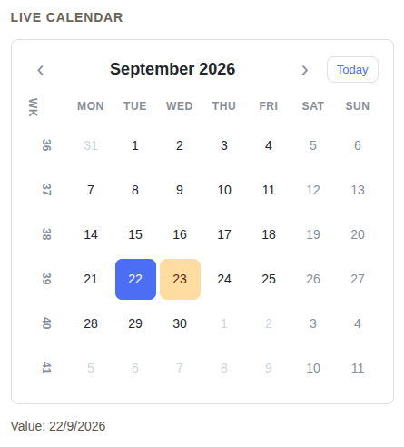 -->

The week numbers follow ISO 8601 (week 1 = the week containing the first Thursday). They
work with `visibleDays` and `selectionMode` — the column is always the first column
regardless of weekday filter.

## Development

Workspace with a publishable library and a showcase demo:

```bash
npm install          # library + demo deps (project references)
ng serve demo        # run the demo at http://localhost:4200
ng test calendulum   # library unit tests (vitest + jsdom)
ng build demo        # production build of the demo
```

## Roadmap

- Month view polish: mobile, keyboard navigation, week numbers
- Event agenda and week/day views
- Date picker, range picker
- Locale/i18n utilities
- Drag & drop for events

## License

[MIT](LICENSE) © 2026 Marco Ornelas
